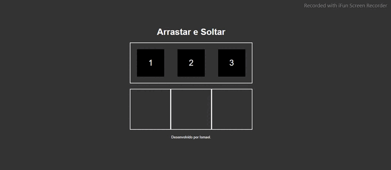

    <h1>Arrasta e solta</h1>

    

    <a href="">Acessar projeto</a>

## 🧾 Sobre

Projeto **Arrasta e Solta** é o estado inicial para criação de Kanban que foi desenvolvido no módulo de **Javascript** do curso **[B7Web](https://alunos.b7web.com.br/)**.

## ⚡ Tecnologias utilizadas

O projeto foi desenvolvido utilizando as seguintes tecnologias.

- HTML5
- CSS3
- Javascript

---
>*Desenvolvido por Ismael Silva*